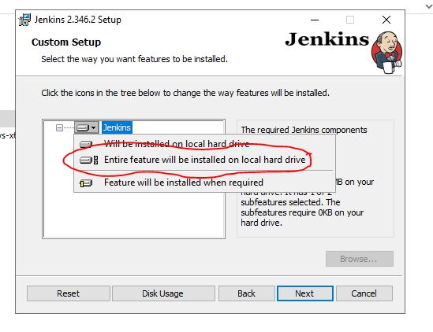
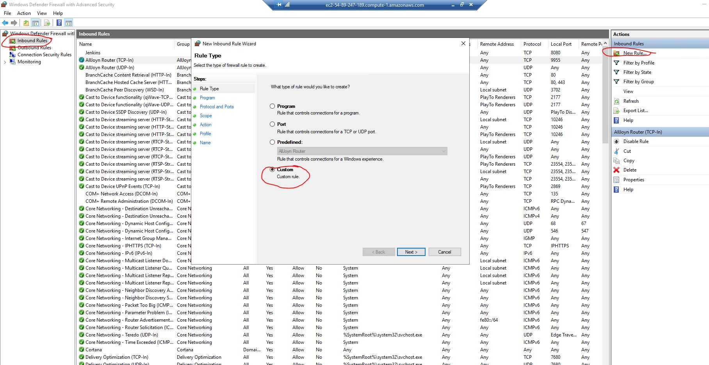
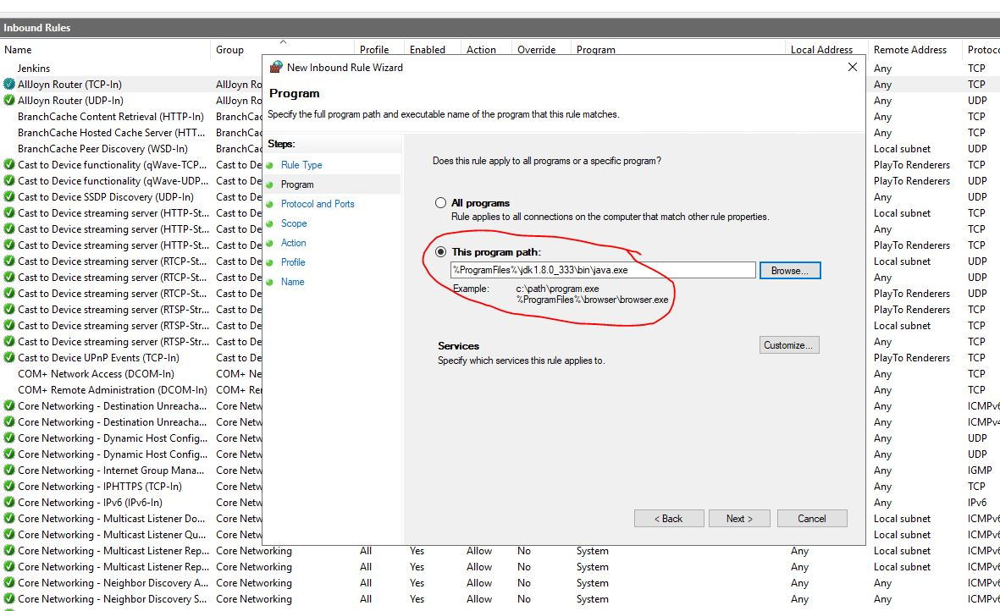
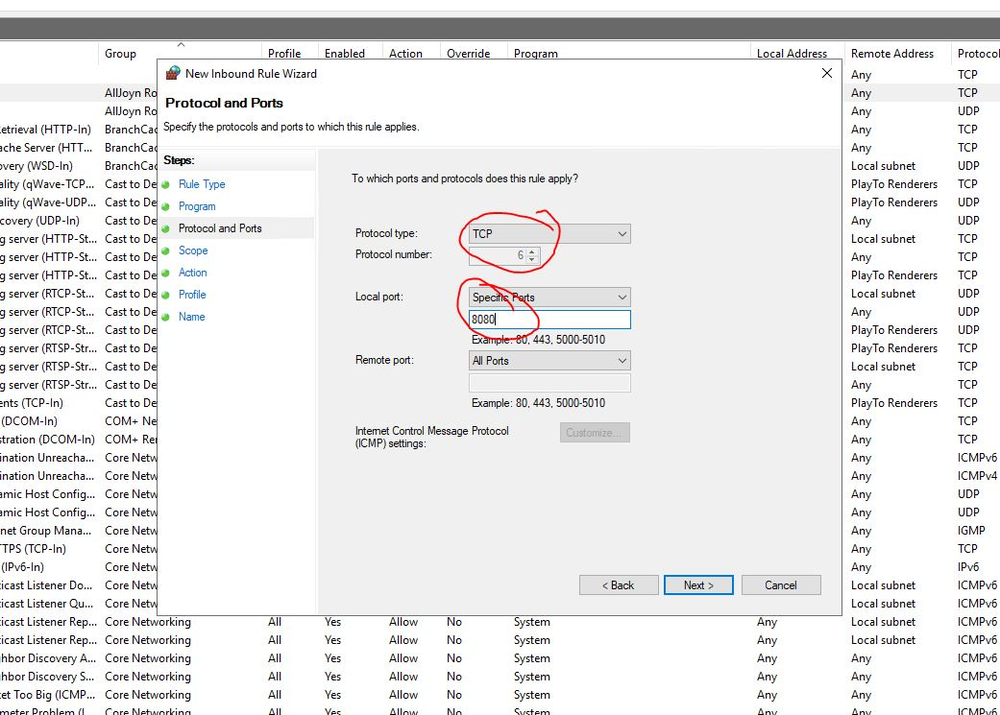
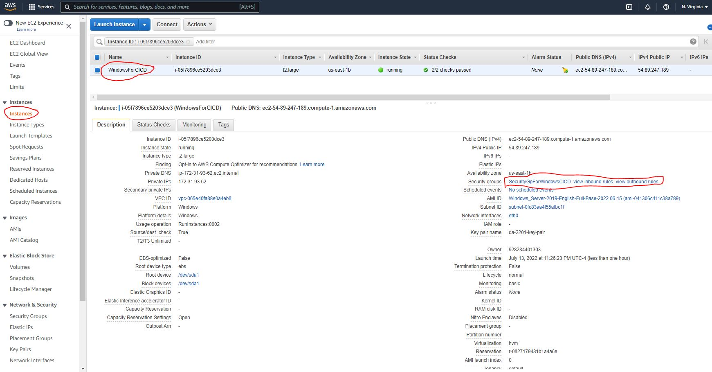
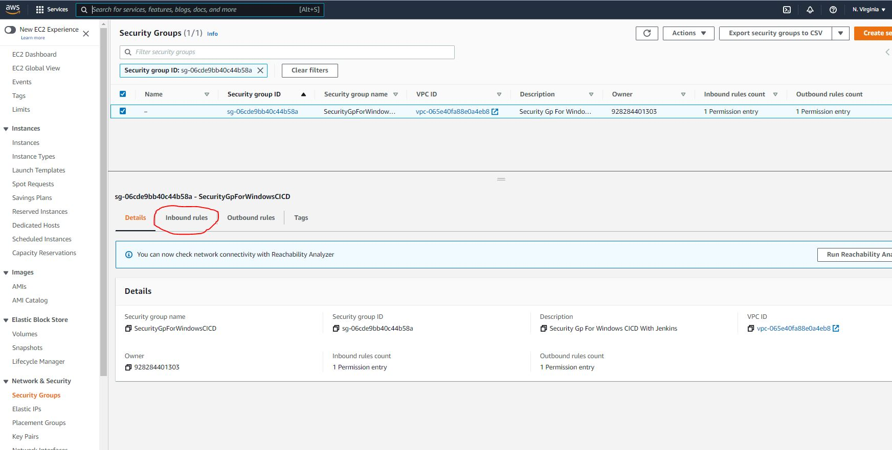
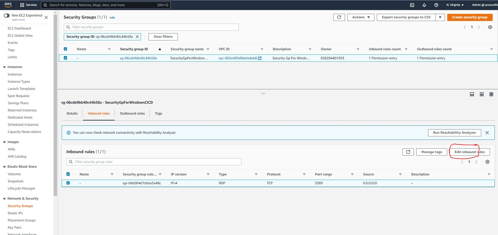
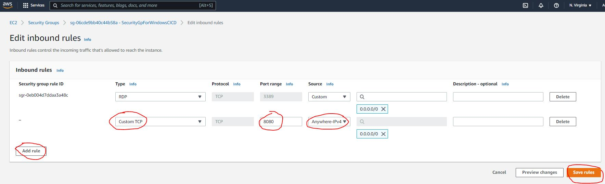
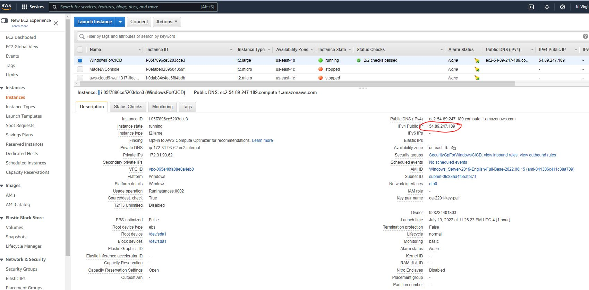
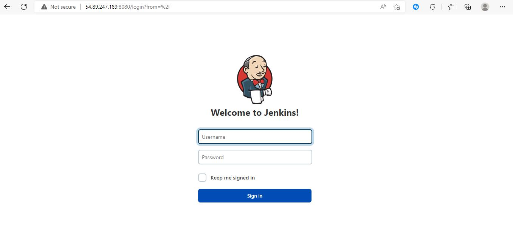

# WebAutomationPractice-Wali

## How to make Jenkins Public through port 8080

##### This can only be done when the instance's 8080 port is open. To make it happen we have to follow these two steps:

1. *Open the port of Windows server firewall*
2. *Open the port in instance's "security groups"*
    
##### Description: 
  
1. *Open the port of Windows server firewall:* This can be done in two ways.
    
   - `During Jenkins Installation:` During installation we need to include the inbound firewall rules for Jenkins. 
     - During firewall setting select "Entire feature will be installed on local hard drive"
       
        
   - `After Jenkins installation:` It can also be done after the installation following below steps.
     - From the windows server search and select "Windows Defender Firewall with Advanced Security".
     - Then select inbound rules
     - Select "New Rule" from action pane
     - Then select "Custom" rule and click on "Next"
     
       
        
     - Do not forget to put java.exe file path in "This program path" and click on "Next"   
      
        
         
     - Select Protocol type "TCP" from drop down menu
     - Type Local port as "8080" and click on "Next"
     
        
         
     - Keep other options as default
     - You can put the rule name as "Jenkins"
   
2. *Open the port in instance's "security groups":* Along with the above task we have to allow this port to the security group of the ec2 instance (Windows Server). To do so follow the following instruction:
    
   - Go to your AWS account
   - From the ec2 dashboard select Instances
   - From the list select the instance on which Jenkins is running
    
    
   
   - From the "Description" tab select "security groups"
   - Click "Inbound rules"
   
      
    
   
   - Now select "Edit inbound rules"
     
    
    
   - Click "Add rule"
   - Select "Custom TCP"
   - Select port range "8080"
   - Select Source "Anywhere-IPV4", you can specify a particular ip or range here.
    
    

3. Now, find out the public ip address of your windows server, use it and get your jenkins from anywhere:
 
 

4. By putting "http://yourpublicip:8080" in the browser, we can get the login page of Jenkins running in Windows Server ec2 machine:
 